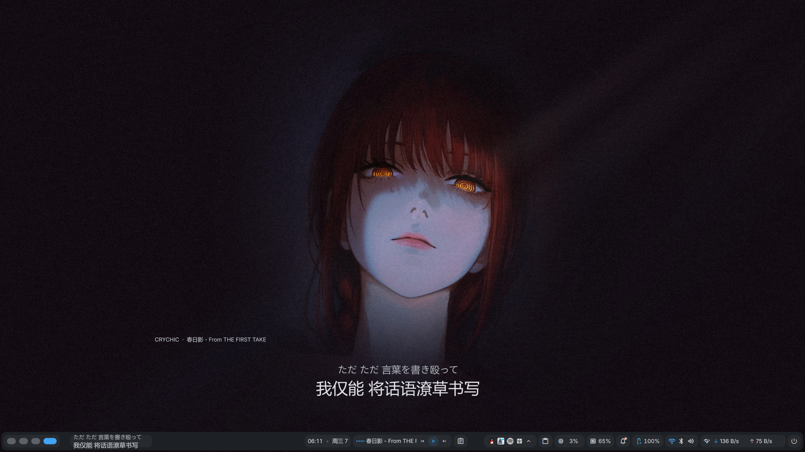

# Desktop Lyrics




Desktop Lyrics 是面向 Arch Linux 与 niri 桌面环境的 DankMaterialShell（DMS）歌词插件。它只跟随 Spotify，在 niri 桌面的 DMS 导航栏中显示当前歌词和翻译，并可同时显示在桌面歌词部件中。

当前版本：`1.0.0`

## 功能

- 在 Arch Linux 的 niri 桌面中，通过 DMS 导航栏实时显示 Spotify 当前歌词。
- 并行查询网易云、QQ 音乐和 LRCLIB。
- 优先显示带时间轴且有翻译的歌词。
- 支持本地 `.lrc` 与 `.txt`，本地文件优先于缓存和网络。
- 按时间轴对齐翻译，并使用 OpenCC 将中文显示为简体。
- 支持歌词偏移、桌面背景透明度、歌曲信息显示和翻译显示开关。
- 查询超时、播放器切换和过期响应不会覆盖当前曲目。

## 目标环境

本插件针对以下环境开发和验证：

- 操作系统：Arch Linux。
- 桌面环境：niri Wayland compositor。
- 桌面壳层：DankMaterialShell `>= 1.5.0`。
- 音乐播放器：通过 MPRIS 暴露状态的 Spotify。
- 显示位置：DMS 导航栏，以及可选的 DMS 桌面歌词部件。

它依赖 niri 会话中的用户 D-Bus、Wayland 和 DMS。不要把它作为独立应用，或用于其他桌面环境、Windows 或 macOS。

## 运行要求

- Arch Linux 上正在运行的 niri 桌面会话。

- DankMaterialShell `>= 1.5.0`，并且 DMS 导航栏已启用。

- Quickshell/QML 运行环境。

- 系统命令：`python3`、`opencc`。

- 网络访问：网易云、QQ 音乐、LRCLIB。

插件只接受以下 D-Bus 名称：

```text
org.mpris.MediaPlayer2.spotify
org.mpris.MediaPlayer2.spotify.*
```

Firefox、Chromium、Edge 等浏览器不会触发歌词查询，也不会把浏览器标题显示到导航栏。Spotify 暂停时保留其歌词；Spotify 退出后取消查询并清空导航栏状态。

## 安装

### 从发布包安装

1. 下载 `desktop-lyrics-1.0.0.zip`。
2. 解压到用户插件目录：

```bash
mkdir -p "${XDG_CONFIG_HOME:-$HOME/.config}/DankMaterialShell/plugins"
unzip -o desktop-lyrics-1.0.0.zip -d "${XDG_CONFIG_HOME:-$HOME/.config}/DankMaterialShell/plugins"
```

3. 确认目录结构为：

```text
~/.config/DankMaterialShell/plugins/DesktopLyrics/plugin.json
```

4. 重新扫描并加载插件：

```bash
dms ipc call plugin-scan rescan desktopLyrics
dms ipc call plugin-scan reload desktopLyrics
```

如果插件尚未被 DMS 识别，先执行：

```bash
dms ipc call plugin-scan scan
dms plugins list
```

### 从源码目录安装

```bash
install -d "${XDG_CONFIG_HOME:-$HOME/.config}/DankMaterialShell/plugins/DesktopLyrics"
rsync -a \
  --include 'plugin.json' \
  --include 'Lyrics*.qml' \
  --include 'fetch_lyrics.py' \
  --exclude '*' \
  ./ "${XDG_CONFIG_HOME:-$HOME/.config}/DankMaterialShell/plugins/DesktopLyrics/"
dms ipc call plugin-scan reload desktopLyrics
```

安装后，在 DMS 的部件设置中启用 `Desktop Lyrics`，并将其添加到导航栏。需要桌面浮层时，再添加到桌面部件区域。

## 设置

插件设置保存在 DMS 的插件配置中，不需要手改源码。

| 设置     | 默认值  | 说明                    |
| ------ | ----:| --------------------- |
| 启用歌词   | 开    | 关闭后导航栏和桌面部件都不再查询或显示歌词 |
| 显示翻译   | 开    | 无翻译时只显示原文             |
| 显示歌曲信息 | 开    | 显示歌手和歌曲名              |
| 背景不透明度 | 35%  | 仅影响桌面部件背景             |
| 歌词偏移   | 0 ms | 正值提前，负值延后，范围 ±2000 ms |
| 本地歌词目录 | 空    | 支持 `歌手 - 歌名.lrc` 等文件名 |

本地文件示例：

```text
~/Music/Lyrics/Artist - Title.lrc
~/Music/Lyrics/Artist/Title.lrc
~/Music/Lyrics/Title.txt
```

## 歌词来源与匹配

查询顺序：

1. 本地 `.lrc` 或 `.txt`。
2. 已验证且未过期的歌词缓存。
3. 网易云、QQ 音乐、LRCLIB 并行查询。

匹配规则：

- 使用歌曲名、歌手、专辑和时长共同判断版本。
- 支持繁简中文、标点差异和 Spotify 添加的标题后缀。
- 使用平台返回的歌手别名，不根据读音猜测。
- 时长相差超过 8 秒的已知候选会被拒绝，以避开片段版和错误录音。
- `Live` 等版本标记不会被忽略。

在线查询总时限为 7.5 秒，插件 watchdog 为 10 秒。带翻译的同步歌词会立即采用；无翻译结果会等待到总时限，以便稍后返回的翻译有机会被选中。

缓存位于：

```text
${XDG_CACHE_HOME:-$HOME/.cache}/DankMaterialShell/desktop-lyrics/
```

- 有翻译或纯音乐结果缓存 30 天。
- 无翻译结果 15 分钟后允许重新补查，并保留最长 30 天作为失败时的后备。
- 删除该目录即可清空歌词缓存，不会删除插件设置。

## 文件说明

```text
Arch-niri-Lyrics/
├── plugin.json               DMS 插件清单
├── LyricsDaemon.qml          Spotify 监听、查询和同步
├── LyricsBarWidget.qml       DMS 导航栏歌词与全文弹窗
├── LyricsDesktopWidget.qml   可选的桌面歌词部件
├── LyricsSettings.qml        插件设置界面
├── fetch_lyrics.py           本地、缓存和在线歌词查询
├── test_fetch_lyrics.py      Python 回归测试
├── test_daemon.cjs           daemon 状态回归测试
├── CHANGELOG.md              行为变更记录
└── README.md                 本说明
```

## 验证

安装依赖后运行：

```bash
python3 -B -m unittest discover -s . -p test_fetch_lyrics.py -v
node test_daemon.cjs
```

当前开发环境验证结果：

- Python：22 项测试通过。
- daemon：Spotify 选择、浏览器拒绝、暂停保留、退出清理和过期响应测试通过。
- 插件清单 JSON、Python 语法和 Node 测试语法检查通过。

这些测试不需要播放音乐。导航栏的实际显示还需要在 Arch Linux 的 niri 会话中运行 DMS 和 Spotify。

## 故障排查

### 导航栏没有显示歌词

确认 DMS 导航栏已启用，并且 `Desktop Lyrics` 已添加到导航栏部件，而不仅是安装了插件文件。可在 DMS 的部件设置中检查导航栏区域。

### Spotify 正在播放但没有反应

检查 Spotify 是否通过 MPRIS 暴露：

```bash
playerctl --list-all
busctl --user list | grep org.mpris.MediaPlayer2.spotify
```

Snap、Flatpak 或网页版 Spotify 可能使用不同的总线名称。只有 `org.mpris.MediaPlayer2.spotify*` 会被接受。

### 显示原文但没有翻译

可能是三个来源都没有可用翻译，也可能是网易云暂时返回“操作频繁”。无翻译缓存会在 15 分钟后允许补查；删除缓存目录可立即重试。

### 歌词和音频不同步

先在插件设置中使用“歌词偏移”。如果差得很多，通常是选中了不同录音或片段版。记录歌曲名、歌手、专辑和 `playerctl metadata mpris:length` 的时长后再排查。

### OpenCC 不可用

确认命令存在：

```bash
opencc --version
```

缺少 OpenCC 时，中文繁简显示和中文元数据标准化无法按设计工作。

## 限制

- 目标环境是 Arch Linux 上的 niri 与 DMS，不是独立应用。
- 导航栏显示依赖 DMS；插件不会直接创建 niri bar。
- 不支持浏览器、本地音乐播放器或其他 MPRIS 播放器。
- 跨语言歌名不会自动音译，例如英文名不会自动猜测对应日文原名。
- 在线歌词网站可能限流、下架或更改接口，因此不能保证每首歌都能查到。

## 卸载

```bash
dms plugins uninstall desktopLyrics
rm -rf "${XDG_CONFIG_HOME:-$HOME/.config}/DankMaterialShell/plugins/DesktopLyrics"
rm -rf "${XDG_CACHE_HOME:-$HOME/.cache}/DankMaterialShell/desktop-lyrics"
```

卸载插件目录不会自动删除 DMS 界面布局中的部件引用；如界面仍显示空部件，在 DMS 部件设置中移除 `Desktop Lyrics`。
